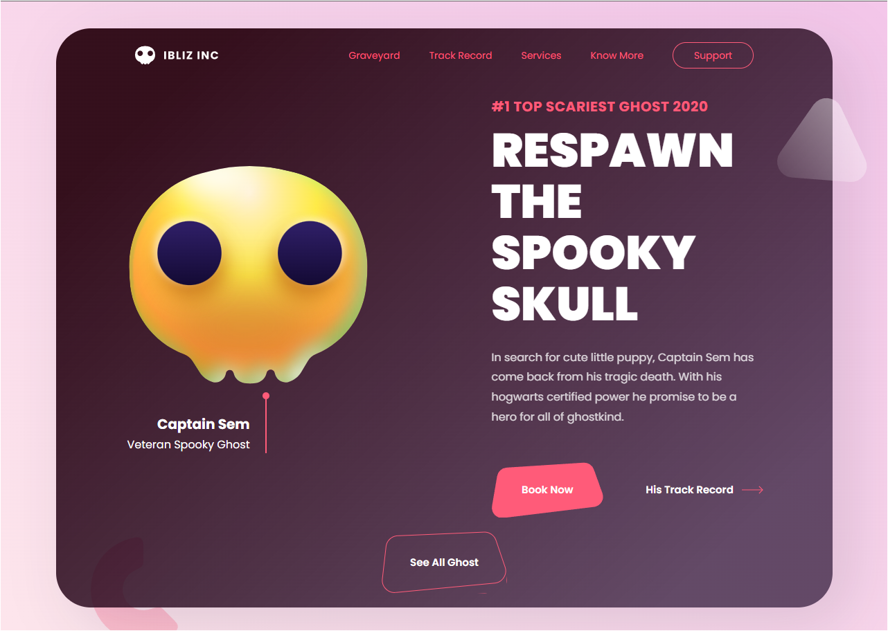

<h1 align="center">Halloween Landing Page</h1>

A Halloween landing page 🎃
<a href="https://welderbm.github.io/Halloween-landingPage/">View the site🎈</a>

## Index

- <a href="#funcionalidades-do-projeto">project features</a>
- <a href="#tecnologias-ultilizadas">Technologies used</a>
- <a href="#pessoas-autoras">Authors</a>

<h2 id="funcionalidades-do-projeto">Features</h2>

- [x] animated button transition
- [x] responsiveness on screen

<h2 id="tecnologias-ultilizadas">Technologies used</h2> 

1. [React](https://react.dev/)
1. [Vite](https://vitejs.dev/)

<h2 id="pessoas-autoras">Authors</h2> 

welder barroso
